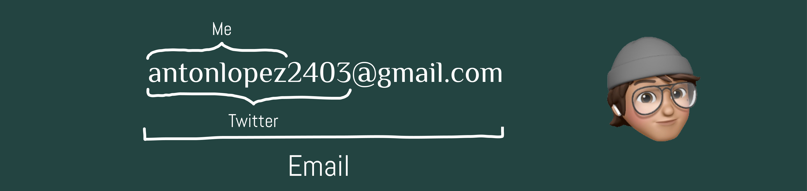

<h1 align="center">Hi  I'm Antón López</h1>
<h3 align="center">git commit -m "Hello, I'm a Software Developer"</h3>
<!---->



<p align="left"> <a href="https://twitter.com/antonlopez2403" target="blank"></a> </p>

### Liked my GitHub ?

- 👨‍💻 All about me is at [My Website](https://antonlnz.github.io/)

- 📝 Sometimes I write articles on [Medium](https://medium.com/@antonlnz)

- 💬 Ask me about ``` var topics = [ "Java", "JavaScript", "HTML", "Python", "CSS", "Deep Learning", "AI" ] ```

- 📫 How to reach me [**antonlopez2403@gmail.com**](mailto:antonlopez2403@gmail.com)

- 📄 Know about my work & experiences [My Resume]()


### What are my featured projects ? 
<code>[Telegram Bot]()</code>🤖  
<code>[Web Server](https://github.com/antonlnz/web-server)</code>🖥️  
<code>[Web Page](https://github.com/antonlnz/antonlnz.github.io)</code>👨‍💻  

### Projects and Dev Stuffs:

<details>	
  <summary><b>⚡ Github Stats</b></summary>

  <br />
  
  
</details>

<details>	
  <summary><b>☄️ Github Streaks</b></summary>

  <br />
  
</details>
 
<details>	
  <br />
  <summary><b>⚙️ Things I use to get stuff done</b></summary>
  	<ul>
  	    <li><b>OS:</b> Mac OS Ventura 13.3</li>
	    <li><b>Laptop: </b> MacBook Pro M2</li>
  	    <li><b>Browser: </b> Firefox Web Browser</li>
	    <li><b>Terminal: </b> ZSH: Oh My Zsh (PowerLevel10k)</li>
	    <li><b>Code Editor:</b> VSCode - The best editor out there.</li>
	    <li><b>To Stay Updated:</b> Dev.to, Medium, Linkedin and Twitter.</li>
	    <br /></a>
	</ul>	
</details>

<div align="center">

</div>

<h3 align="left">Connect with me:</h3>
<p align="left">
<a href="https://twitter.com/antonlopez2403" target="blank"></a>
<a href="https://linkedin.com/in/antonlnz" target="blank"></a>
<a href="https://medium.com/@antonlnz" target="blank"></a>
</p>

<h3 align="left">Languages and Tools:</h3>
<p align="left">

<a href="https://git-scm.com/" target="_blank" rel="noreferrer">  </a>
<a href="https://www.java.com" target="_blank" rel="noreferrer">  </a>
<a href="https://www.python.org" target="_blank" rel="noreferrer">  </a>
<a href="https://www.w3.org/html/" target="_blank" rel="noreferrer">  </a>
<a href="https://developer.mozilla.org/en-US/docs/Web/JavaScript" target="_blank" rel="noreferrer">  </a>
<a href="https://www.docker.com/" target="_blank" rel="noreferrer">  </a> 
<a href="https://heroku.com" target="_blank" rel="noreferrer">  </a> 
<a href="https://www.tensorflow.org" target="_blank" rel="noreferrer">  </a>


<!--- <a href="https://aws.amazon.com" target="_blank" rel="noreferrer">  </a> -->

<!--- <a href="https://getbootstrap.com" target="_blank" rel="noreferrer">  </a> <a href="https://www.cprogramming.com/" target="_blank" rel="noreferrer">  </a> -->

<!--- <a href="https://couchdb.apache.org/" target="_blank" rel="noreferrer">  </a> -->

<!--- <a href="https://www.w3schools.com/cpp/" target="_blank" rel="noreferrer">  </a> -->

<!--- <a href="https://www.w3schools.com/css/" target="_blank" rel="noreferrer">  </a> -->

<!--- <a href="https://www.elastic.co" target="_blank" rel="noreferrer">  </a> -->

<!--- <a href="https://www.gatsbyjs.com/" target="_blank" rel="noreferrer">  </a> -->

<!--- <a href="https://golang.org" target="_blank" rel="noreferrer">  </a> -->

<!--- <a href="https://grafana.com" target="_blank" rel="noreferrer">  </a> -->

<!--- <a href="https://www.jenkins.io" target="_blank" rel="noreferrer">  </a> -->

<!--- <a href="https://kafka.apache.org/" target="_blank" rel="noreferrer">  </a> -->

<!--- <a href="https://www.elastic.co/kibana" target="_blank" rel="noreferrer">  </a> -->

<!--- <a href="https://kotlinlang.org" target="_blank" rel="noreferrer">  </a> -->

<!--- <a href="https://kubernetes.io" target="_blank" rel="noreferrer">  </a> -->

<!--- <a href="https://www.mysql.com/" target="_blank" rel="noreferrer">  </a> -->

<!--- <a href="https://www.nginx.com" target="_blank" rel="noreferrer">  </a> -->

<!--- <a href="https://opencv.org/" target="_blank" rel="noreferrer">  </a> -->

<!--- <a href="https://www.php.net" target="_blank" rel="noreferrer">  </a> -->

<!--- <a href="https://www.postgresql.org" target="_blank" rel="noreferrer">  </a> -->

<!--- <a href="https://postman.com" target="_blank" rel="noreferrer">  </a> -->

<!--- <a href="https://scikit-learn.org/" target="_blank" rel="noreferrer">  </a> -->

<!--- <a href="https://spring.io/" target="_blank" rel="noreferrer">  </a> -->

</p>

<h3 align="left">Support:</h3>
<p><a href="https://www.buymeacoffee.com/antonlnz"> </a></p>
